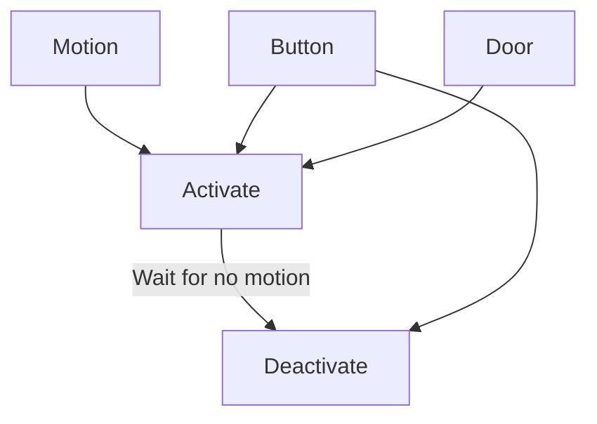

# Room Controller



### Behaviors

#### Button

| Action       | Response                                    |
|--------------|---------------------------------------------|
| Single-press | Toggle the room state (activate/deactivate) |
| Long-press   |                                             |
| Double-press | Toggle sleep mode, then activate room       |

#### Door

Activates the room if the door opens when everything in the room is off.

### Config

#### Required

| Key      | Behavior                                     |
|----------|----------------------------------------------|
| `entity` | Main entity for the room                     |
| `sensor` | `binary_sensor` (motion) sensor for the room |
| `scene`  | List of states and times for the room.       |
| `sleep`  | [input_boolean] of the sleep mode variable   |

[input_boolean]: https://www.home-assistant.io/integrations/input_boolean/

"Example state for `scene` key"

    ```yaml
    - time: 22:00:00
      off_duration: 00:02:00 # (1)
      scene:
        light.kitchen:
          state: on
          color_temp: 650
          brightness_pct: 10
    ```

    1. (Optional) overrides the default `off_duration` for this period only

#### Optional

| Key            | Behavior                                                                                |
|----------------|-----------------------------------------------------------------------------------------|
| `off_duration` | Default time for the motion sensor to be clear before deactivating the room. `HH:MM:SS` |
| `button`       | ID of the button to control the room                                                    |
| `door`         | `binary_sensor` (door) sensor for the room                                              |

??? example "Sample Button Event Data"

    ```yaml hl_lines="3"
    event_type: deconz_event
    data:
      id: living_room
      unique_id: 00:15:8d:00:06:ba:29:70
      event: 1002
      device_id: fc0ad75dfb8d3a55abfe842199cc94e9
    origin: LOCAL
    time_fired: "2023-04-26T05:40:39.762306+00:00"
    context:
      id: 01GYY17ZPJVP57C8PN1K3R4D7J
      parent_id: null
      user_id: null
    ```

## Running with Docker

Needs to have a `requirements.txt` file in the same directory as the `Dockerfile`

```dockerfile
FROM python:3.10

# install order matters because of some weird dependency stuff with websocket-client
# install appdaemon first because it's versioning is more restrictive
RUN pip install git+https://github.com/AppDaemon/appdaemon@dev

ENV CONF=/conf
RUN mkdir $CONF
COPY ./requirements.txt ${CONF}
RUN --mount=type=cache,target=/root/.cache/pip pip install -r ${CONF}/requirements.txt
```

```yaml
version: "3.8"
services:
  appdaemon:
    container_name: appdaemon
    image: acockburn/appdaemon:dev
    volumes:
      - /etc/localtime:/etc/localtime:ro
      - /etc/timezone:/etc/timezone:ro
      - config:/conf
    ports:
      - 5050:5050
    restart: unless-stopped


volumes:
  config:
    driver: local
    driver_opts:
      o: bind
      type: none
      device: ./
```
