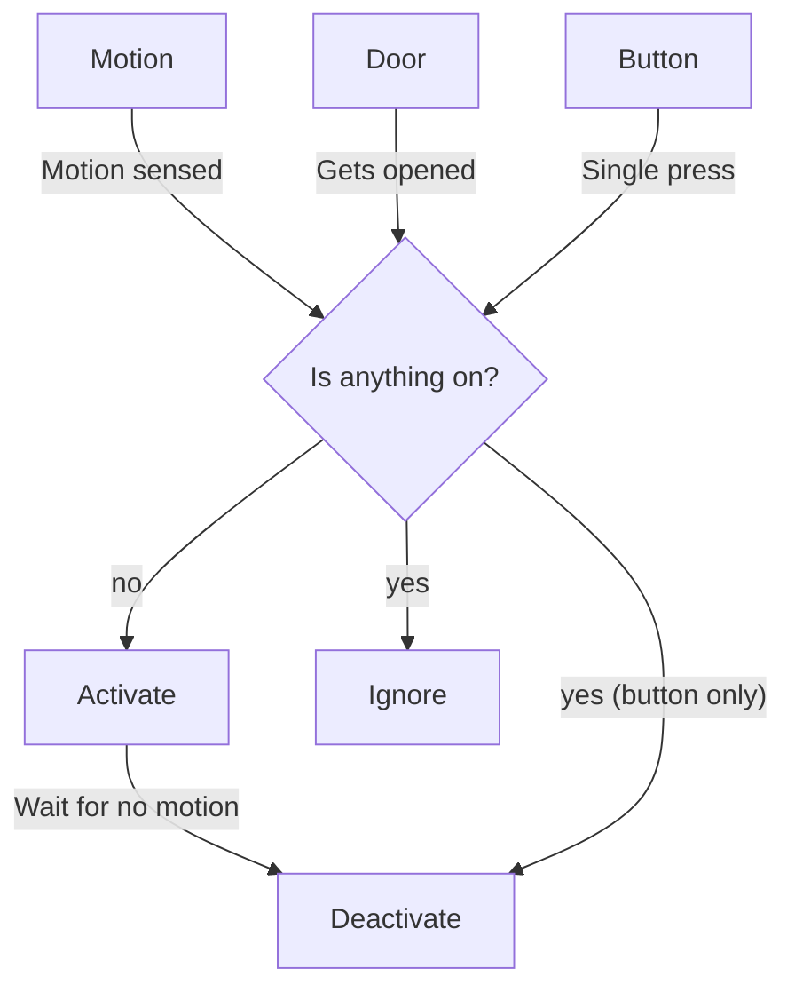

# Room Controller



### Behaviors

#### Button

| Action       | Response                                    |
|--------------|---------------------------------------------|
| Single-press | Toggle the room state (activate/deactivate) |
| Double-press | Toggle sleep mode, then activate room       |

Sample button event data:

```yaml
event_type: deconz_event
data:
  id: living_room
  unique_id: 00:15:8d:00:06:ba:29:70
  event: 1002
  device_id: fc0ad75dfb8d3a55abfe842199cc94e9
origin: LOCAL
time_fired: "2023-04-26T05:40:39.762306+00:00"
context:
  id: 01GYY17ZPJVP57C8PN1K3R4D7J
  parent_id: null
  user_id: null
```

#### Door

Activates the room if the door opens when everything in the room is off.

### Config

#### Required

| Key      | Behavior                                     |
|----------|----------------------------------------------|
| `entity` | Main entity for the room                     |
| `sensor` | `binary_sensor` (motion) sensor for the room |
| `states` | List of states and times for the room.       |

#### Optional

| Key            | Behavior                                                                                |
|----------------|-----------------------------------------------------------------------------------------|
| `off_duration` | Default time for the motion sensor to be clear before deactivating the room. `HH:MM:SS` |
| `button`       | ID of the button to control the room ([Aqara mini switch])                              |
| `ha_button`    | entity ID of the Home Assistant [input button]                                          |
| `door`         | `binary_sensor` (door) sensor for the room                                              |
| `sleep`        | [input_boolean] of the sleep mode variable                                              |

[input_boolean]: https://www.home-assistant.io/integrations/input_boolean/
[Aqara mini switch]: https://www.amazon.com/Aqara-WXKG11LM-Switch-Wireless-Remote/dp/B07D19YXND
[input button]: https://www.home-assistant.io/integrations/input_button/

### State Definition

States can be defined 3 ways:
- Using the `time` key (parsed with [`appdaemon.adapi.ADAPI.parse_time`])
    - `HH:MM:SS[.ss]` - the time in Hours Minutes, Seconds and Microseconds, 24 hour format.
    - `sunrise|sunset [+|- HH:MM:SS[.ss]]` - time of the next sunrise or sunset with an optional positive or negative offset in Hours Minutes, Seconds and Microseconds.
- Using the `elevation` key (uses [`astral.sun.time_at_elevation`])
  - Requires an additional `direction` key with wither `rising` or `setting`

Examples state for `states` key

```yaml
- time: 06:00:00
  off_duration: 00:05:00
  scene:
    light.kitchen:
      state: on
      color_temp: 250
      brightness_pct: 10
- time: sunset - 00:30:00
  scene:
    light.kitchen:
      state: on
      color_temp: 500
      brightness_pct: 30
- elevation: -20
  direction: setting
  scene:
    light.kitchen:
      state: on
      color_temp: 650
      brightness_pct: 10
```

[`appdaemon.adapi.ADAPI.parse_time`]: https://appdaemon.readthedocs.io/en/latest/AD_API_REFERENCE.html#appdaemon.adapi.ADAPI.parse_time
[`astral.sun.time_at_elevation`]: https://astral.readthedocs.io/en/latest/package.html#astral.sun.time_at_elevation

## Running with Docker

Use this command from the appdaemon config directory to clone this repo as a submodule (recommended):

```
git submodule add -b main https://github.com/jsl12/room_control ./apps/room_control
```

```
git submodule update --remote
```

```shell
./appdaemon_config
├── apps
│   ├── room_control
│   └── rooms
├── appdaemon.yaml
├── docker-compose.yml
└── secrets.yaml
```

Example `docker-compose.yml`:

```yaml
version: "3.8"
services:
  appdaemon:
    container_name: appdaemon
    image: acockburn/appdaemon:dev
    volumes:
      - /etc/localtime:/etc/localtime:ro
      - /etc/timezone:/etc/timezone:ro
      - config:/conf
    ports:
      - 5050:5000
    restart: unless-stopped

volumes:
  config:
    driver: local
    driver_opts:
      o: bind
      type: none
      device: ./
```

Example `secrets.yaml`. Token from [profile in Home Assistant](http://homeassistant:8123/profile)

```yaml
long_lived_token: <TOKEN>
```
