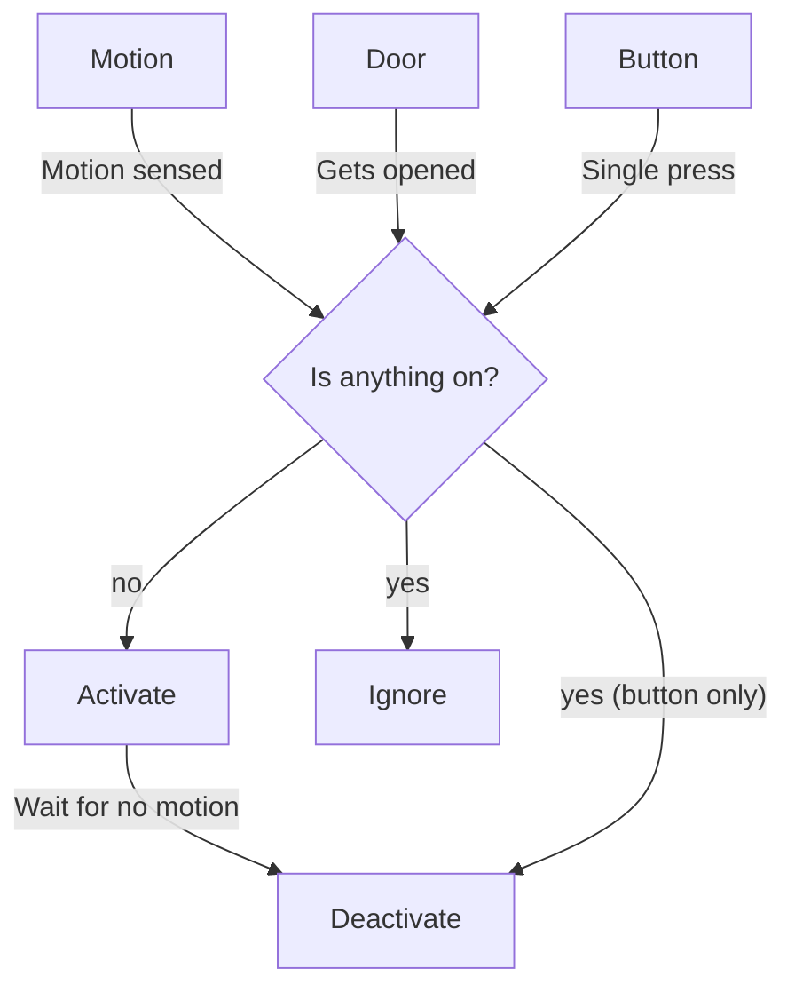

# Room Controller



### Behaviors

#### Button

| Action       | Response                                    |
|--------------|---------------------------------------------|
| Single-press | Toggle the room state (activate/deactivate) |
| Long-press   |                                             |
| Double-press | Toggle sleep mode, then activate room       |

#### Door

Activates the room if the door opens when everything in the room is off.

### Config

#### Required

| Key      | Behavior                                     |
|----------|----------------------------------------------|
| `entity` | Main entity for the room                     |
| `sensor` | `binary_sensor` (motion) sensor for the room |
| `scene`  | List of states and times for the room.       |
| `sleep`  | [input_boolean] of the sleep mode variable   |

[input_boolean]: https://www.home-assistant.io/integrations/input_boolean/

Example state for `scene` key

```yaml
- time: 22:00:00
  off_duration: 00:02:00
  scene:
    light.kitchen:
      state: on
      color_temp: 650
      brightness_pct: 10
```

#### Optional

| Key            | Behavior                                                                                |
|----------------|-----------------------------------------------------------------------------------------|
| `off_duration` | Default time for the motion sensor to be clear before deactivating the room. `HH:MM:SS` |
| `button`       | ID of the button to control the room                                                    |
| `door`         | `binary_sensor` (door) sensor for the room                                              |

Sample Button Event Data

```yaml
event_type: deconz_event
data:
  id: living_room
  unique_id: 00:15:8d:00:06:ba:29:70
  event: 1002
  device_id: fc0ad75dfb8d3a55abfe842199cc94e9
origin: LOCAL
time_fired: "2023-04-26T05:40:39.762306+00:00"
context:
  id: 01GYY17ZPJVP57C8PN1K3R4D7J
  parent_id: null
  user_id: null
```

## Running with Docker

Clone repo into `apps/room_control` of your appdaemon config folder.

```shell
./appdaemon_config
├── apps
│   ├── room_control
│   └── rooms
└── docker-compose.yml
```

Example `docker-compose.yml`:

```yaml
version: "3.8"
services:
  appdaemon:
    container_name: appdaemon
    image: acockburn/appdaemon:dev
    volumes:
      - /etc/localtime:/etc/localtime:ro
      - /etc/timezone:/etc/timezone:ro
      - config:/conf
    ports:
      - 5050:5050
    restart: unless-stopped

volumes:
  config:
    driver: local
    driver_opts:
      o: bind
      type: none
      device: ./
```
